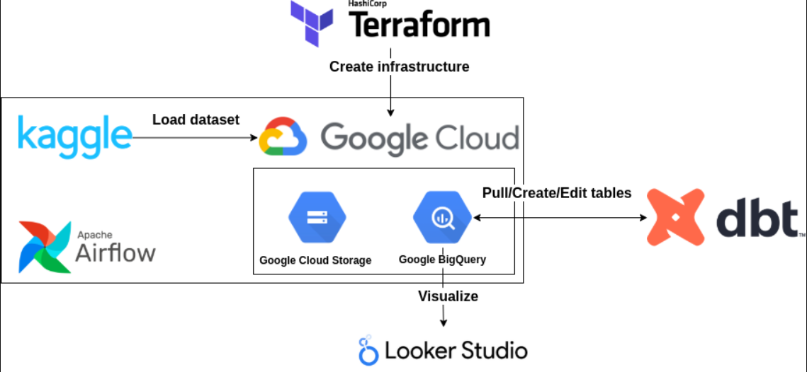
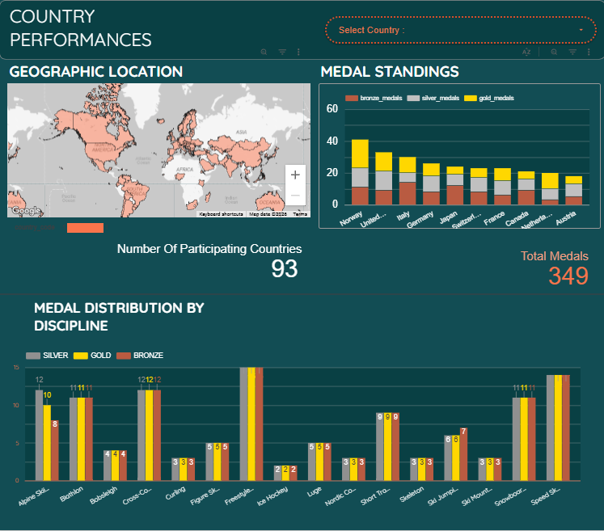
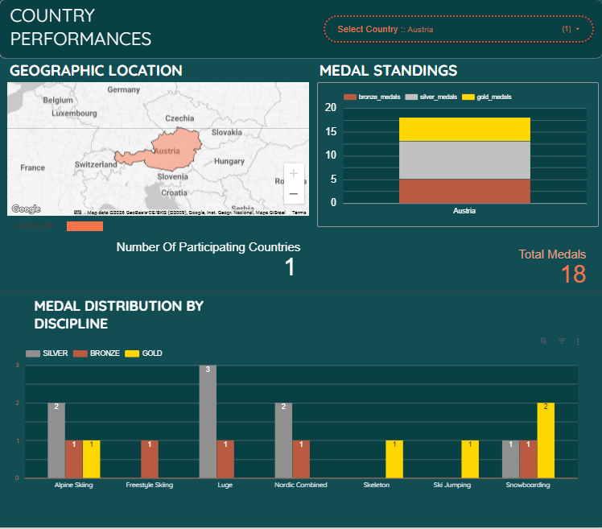
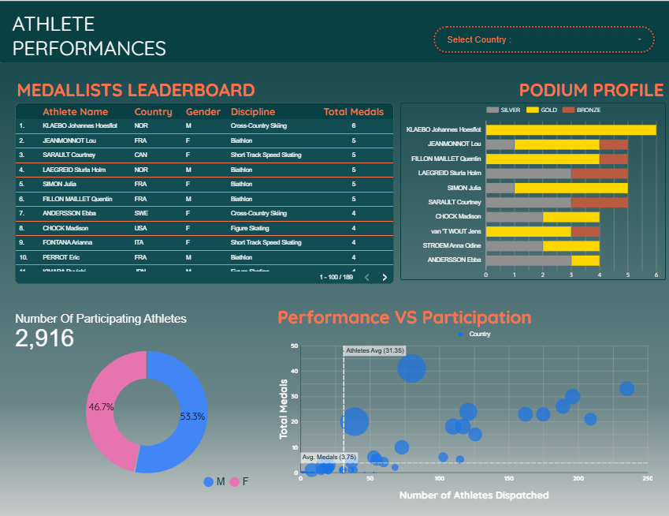
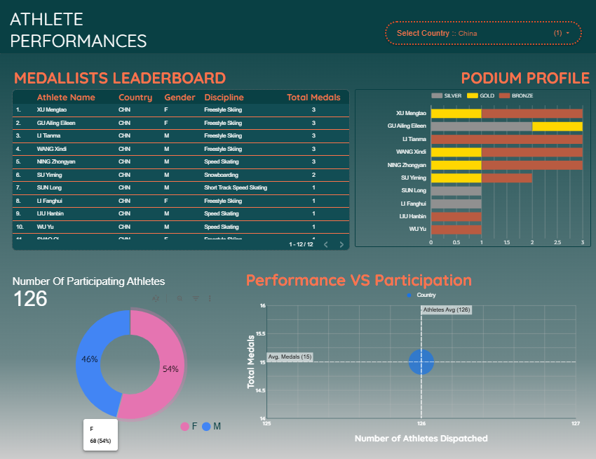

<p align="center">
   <br>
  
</p>

<div align="center">
  <h1> Milano-Cortina 2026 Winter Olympics Data Pipeline</h1>
  


</div>


This project builds a cloud-based end-to-end data pipeline to ingest, transform, and analyze the [Milano-Cortina 2026 Winter Olympics dataset](https://www.kaggle.com/datasets/piterfm/milano-cortina-2026-olympic-winter-games) from Kaggle.
Using Terraform for infrastructure-as-code, Apache Airflow for orchestration, dbt for transformation, and BigQuery as the data warehouse, the solution establishes a dimensional star schema that enables fast, intuitive analysis. The result is a governed, self-service analytics platform where users can explore Olympic data independently through Looker Studio.
The analysis answers questions such as:
- which athletes and countries performed best
- how medals are distributed across disciplines and gender 
- and how efficiently countries convert athlete participation into medals.

## Architecture

<p >
   <br>
</p>


## Tech Stack

| Layer | Tool | Purpose |
|---|---|---|
| **Infrastructure** | Terraform | Creates GCS bucket and BigQuery dataset on GCP |
| **Orchestration** | Apache Airflow (Docker) | Runs DAGs which download the dataset from kaggle,extracts and converts csv to parquet files and loads to Google Cloud Storage|
| **Data Lake** | Google Cloud Storage | Stores raw Parquet files |
| **Data Warehouse** | BigQuery | Hosts raw + transformed tables |
| **Transformation** | dbt Cloud | Builds staging and mart models (star schema) |
| **Visualization**  | Looker Studio | Presents meaningful data in the form of charts and graphs from transformed dbt models in BigQuery |

---
## Dashboard
### Country Performances 
<p >
   
  
</p> 

Country Performances analyzes the performances of the participating countries: 
- **Geographic Location** : shows where the country is located on the world map.<br>
Data Source = fact_country_perf

- **Medal standings** : ranks the top 10 nations by medals won using a stacked bar which shows the number of gold, silver and bronze medals won. When a country is selected, it displays the medals won for that singular selected country.<br>
Data Source = fact_country_perf
- **Total medals** , **Number of participating countries** : are dynamic scorecards which show the total value of what they represent when unfiltered. When a country is selected, the re-aggregate the values for that singular country selected.<br>
Data Source = fact_country_perf

- **Medal Distribution By Discipline** : by default indicates the total number of medals awarded per discipline, when a country is selected, it shows the disciplines in which the medals were obtained.<br>
Data Source = fact_discipline

### Athlete Performances

<p >
   
  
</p>

- **Medallists Leaderboard**: Displays the total number of medals won by an athlete, their name,country,gender and discipline of athletes who won medals **only**.This is sorted in descending order. When a country is selected, it displays the medallists and their corresponding data for the selected country.<br>
Data Source = fact_athlete_perf
- **Podium Profile** : Displays the type of medals won by the athletes<br>
Data Source = fact_athlete_perf
- **Number of participating athletes,Gender Doughnut**: By default displays the total number of athletes who participated in the winter olympics segregated by gender.Upon selecting a country, it displays the total number of athletes from that country also segregated by gender.<br>
Data Source = dim_athletes
- **Performance Participation**: Plots The number of athletes presented by each country against the number of medals they won and find the average of both metrics. The metric of the bubble is conversion rate. It is determined by how efficiently a country's athlete participation translated to medal wins. So high number of athletes participation with relatively low medal returns gives a lower conversion rate etc.<br>
Data Source = fact_country_perf

Link to my dashboard : 
https://datastudio.google.com/u/0/reporting/420ff262-7db0-4655-81cd-e04e8d949c81/page/p_nqhqaiun2d

## Prerequisites

- **GCP Account** with a project and service account  | *[ Video Tutorial](https://www.youtube.com/watch?v=Y2ux7gq3Z0o&list=PL3MmuxUbc_hJed7dXYoJw8DoCuVHhGEQb&index=6)*
- **Docker & Docker Compose** for running Airflow
- **Terraform** CLI 
- **dbt Cloud** account | *[ Video Tutorial](https://www.youtube.com/watch?v=J0XCDyKiU64&list=PL3MmuxUbc_hJed7dXYoJw8DoCuVHhGEQb&index=32)*

## Quick Start

Fork or clone the repository and install terraform in your cli.

### 1. Infrastructure Provision(Terraform) 

```bash
cd terraform
# Place your GCP service account key as keys.json
# Update project_id in variables.tf with your GCP project ID
terraform init
terraform apply
```

> **Note:** See the [Terraform Setup Guide](terraform/README.MD) for more detailed instructions.

### 2. Generate Environment File

```bash
bash generate_env.sh
# This writes airflow/.env with your GCP config values
```

### 3. Start Airflow & Run DAGs

> **Note:** See the [Airflow Setup Guide](airflow/README.md) for more detailed instructions.

```bash
cd ../airflow
docker-compose build
docker-compose up -d
```

Forward **http://127.0.0.1:8080** (login: `airflow` / `airflow`) and trigger the DAGs in order:

1. **`load_to_gcs`** — Downloads the Kaggle dataset, converts CSVs to Parquet, uploads to GCS
2. **`gcs_to_bigquery`** — Loads Parquet files from GCS into BigQuery tables


### 4. Transform Data (dbt Cloud)

See [dbt/README.md](dbt/README.md) for detailed setup instructions.

1. Connect your dbt Cloud project to this repository
2. Set up the BigQuery connection with your service account key
3. Set the `gcp_project_id` variable in your dbt Cloud environment
4. Run:

   ```
   dbt build
   ```

The dbt layer transforms raw BigQuery tables into a star schema:

**Dimensions:** `dim_athletes`, `dim_countries`, `dim_discipline`, `dim_events`

**Facts:** `fact_athlete_perf`, `fact_country_perf`, `fact_discipline`

---

## Acknowledgments

**Special thanks to [DataTalks Club](https://datatalks.club/)** for providing the comprehensive data engineering curriculum and platform that guided this project. This pipeline was developed as a **Capstone Project** requirement for the DataTalks Club Data Engineering Zoomcamp, showcasing end-to-end data engineering practices from infrastructure provisioning through analytics visualization.

