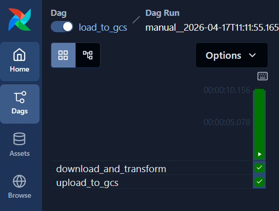
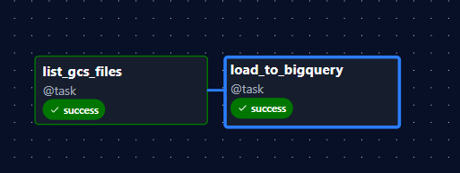
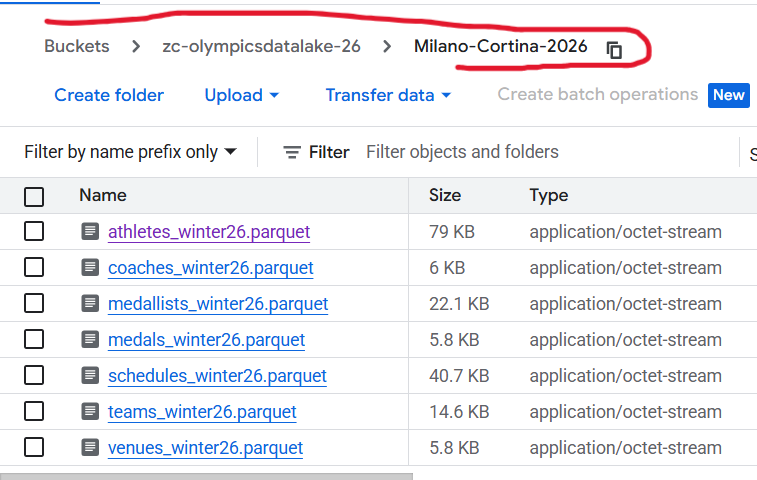
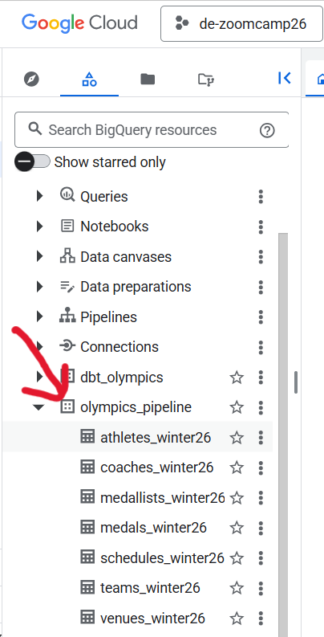

# Airflow Pipeline Setup

## Quick Start

Navigate to airflow directory and Initialize Airflow directories and environment:

```bash
mkdir -p ./logs ./plugins ./config
```


## Overview

This Airflow setup includes **two DAGs** that form the data ingestion pipeline:


1. **`load_to_gcs`** — Downloads the Milano Cortina 2026 Olympics dataset from Kaggle, converts CSVs to Parquet, and uploads them to Google Cloud Storage.
<p >
   
</p> 


2. **`gcs_to_bigquery`** — Reads the Parquet files from GCS and loads them into BigQuery tables.

<p >
   
</p> 


## Prerequisites

1. ✅ **GCS Bucket** created via Terraform (default: `zc-olympicsdatalake-26`)
2. ✅ **GCP Service Account Credentials** in `terraform/keys.json`
3. ✅ **Docker & Docker Compose** installed on your system
4. ✅ **`.env` file** generated by `terraform/generate_env.sh` (or created manually)

## Configuration

All GCP-specific values are read from environment variables (set in `.env`):

| Variable | Description | Default |
|---|---|---|
| `GCP_PROJECT_ID` | Your GCP project ID | `xxxx-xxxx-xxxx` |
| `GCS_BUCKET_NAME` | GCS bucket for data lake | `zc-olympicsdatalake-26` |
| `GCS_PREFIX` | Path prefix in GCS bucket | `Milano-Cortina-2026` |
| `BQ_DATASET_ID` | BigQuery dataset name | `olympics_pipeline` |

These are automatically set if you used `terraform/generate_env.sh`.

## Building & Running

### Start the Docker Image

```bash
docker-compose up -d
```

This installs all required dependencies including:
- Apache Airflow with Google Cloud providers
- Google Cloud Storage and BigQuery clients
- pandas and pyarrow for CSV → Parquet conversion

Wait for services to be healthy (30-60 seconds):

### Access the Airflow UI

- **URL:** http://127.0.0.1:8080
- **Username:** airflow
- **Password:** airflow

### Run the Pipeline

Run the DAGs **in this order**:

1. **Trigger `load_to_gcs`** — Downloads data, converts to Parquet, uploads to GCS
2. **Trigger `gcs_to_bigquery`** — Loads Parquet files from GCS into BigQuery tables

Each DAG can be triggered via the play button (►) in the Airflow UI.


## What Gets Uploaded

**GCS (after `load_to_gcs`):**

<p >
   
</p> 

**BigQuery (after `gcs_to_bigquery`):**

<p >
   
</p> 

## Troubleshooting

### DAG Not Appearing?
```bash
docker-compose down -v  # Clean up
docker-compose build --no-cache  # Rebuild
docker-compose up -d    # Start fresh
```

### Check Logs
```bash
docker-compose logs -f airflow-scheduler
```


---

**Note:** For production deployments, consider:
- Using more secure credential management (Google Secret Manager)
- Setting up proper Airflow authentication
- Adding data validation checks

---

## ✨ Next Steps: Transform Data with dbt

The next stage of the pipeline is to **transform and model** this data using **dbt cloud** for analytics.

→ **[Proceed to dbt Transformation Setup](../dbt/README.md)**

This will guide you through:
- Setting up dbt models for dimension and fact tables
- Running data transformations on BigQuery
- Creating dimensional and factual views for analytics
