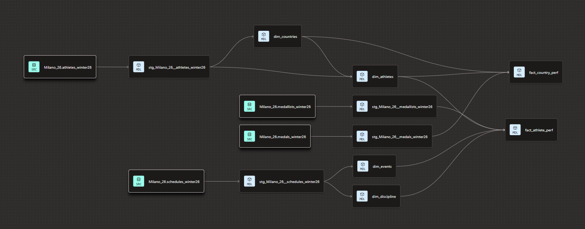

# Olympics data transformation

This dbt project transforms raw Olympic data (loaded into BigQuery by Airflow) into a dimensional star schema for analytics and dashboarding.

> **Note:** This project was developed and tested on **dbt Cloud**. Follow the setup instructions below to reproduce it.


## Setup (dbt Cloud)


1. Create a **dbt Cloud** account 
2. Create a new project and connect it to your repository
3. Set the **BigQuery connection** in **Account Settings → Projects → Connections**:
   - Upload your GCP service account key JSON file
   - **Dataset location must match what you originally used as your default location in Terraform. If you did not alter the default location in Terraform, it is likely 'us-central1' in dbt so ensure that it is changed to EU**
   - use 'dbt' as the project sub-directory
4. In dbt/models/staging/sources.yaml, change the database name to match your GCP project ID
5. Run the following in the dbt Cloud IDE:
   
   ```
   dbt build
   ```


## Data Model And Lineage

<p >
   
</p>


### Staging Layer (`models/staging/`)

Staging models clean and type-cast the raw BigQuery tables. They follow the `stg_<source>__<table>` naming convention.

| Model | Source Table | Purpose |
|---|---|---|
| `stg_Milano_26__athletes_winter26` | `athletes_winter26` | Typed athlete profiles with uppercase country/gender codes |
| `stg_Milano_26__medallists_winter26` | `medallists_winter26` | Typed individual medallist records |
| `stg_Milano_26__medals_winter26` | `medals_winter26` | Typed country-level medal tally |
| `stg_Milano_26__schedules_winter26` | `schedules_winter26` | Typed event schedules with timestamps |

### Marts Layer (`models/marts/core/`)

Mart models build the star schema from staged data.

**Dimensions:**

| Model | Description |
|---|---|
| `dim_athletes` | Unique athletes enriched with country name (via IOC codes seed) |
| `dim_countries` | Participating countries with full names from IOC lookup |
| `dim_discipline` | Sport disciplines with standardized names |
| `dim_events` | Events with surrogate keys, expanded by gender for mixed events |

**Facts:**

| Model | Description |
|---|---|
| `fact_athlete_perf` | One row per medal won — athlete, event, discipline, total medals, multi-medallist flag |
| `fact_country_perf` | Country-level medal counts, athlete counts, and medal conversion rate |
| `fact_discipline` | Medal counts aggregated by country, discipline, and medal type |


### Seeds

| Seed | Description |
|---|---|
| `ioc_codes` | International Olympics Committee country code → country name lookup (208 countries) |


## Resources

- [dbt Cloud documentation](https://docs.getdbt.com/docs/cloud/about-cloud-setup)
- [dbt BigQuery connection](https://docs.getdbt.com/docs/cloud/connect-data-platform/connect-bigquery)
- [dbt best practices](https://docs.getdbt.com/best-practices)

---

## ✨ Next Steps: Visualize Your Data

Your transformed data is now ready for analysis. The final stage of the pipeline is to **visualize and explore** your Olympic data using **Looker Studio dashboards**.

→ **[View Visualization & Dashboard Guide](../README.md#dashboard)**

This includes:
- **Country Performances Dashboard** — Geographic location, medal standings, and discipline breakdowns
- **Athlete Performances Dashboard** — Medallists leaderboard, podium profiles, and participation analysis
- **Interactive Filters** — Drill down by country, discipline, and medal type


